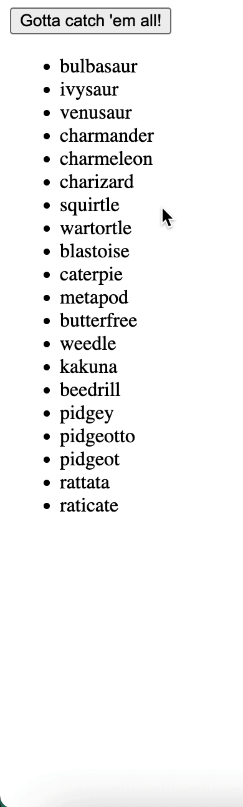

# Intro to Fetch Lab
 
 You will be creating a basic webpage that communicates with three APIs. The basic HTML file has been created for you and is linked to a blank JavaScript file. You are allowed to edit the HTML and you'll need to write all the JavaScript code to build out the following features. You must make `GET` requests using  [`fetch`](https://developer.mozilla.org/en-US/docs/Web/API/Fetch_API/Using_Fetch). You may use the `.then()` or the `async/await` syntax.
 
 ## Feature 1: Star Wars API
 
When the user clicks on the "Get Opening Crawl" button, it will add the opening crawl of one of the Star Wars movies to the `#star-wars` div. You will be using the [Star Wars API](https://swapi.dev/documentation). If the user clicks on the button again, since the opening crawl is already displayed, then nothing about your webpage should change. We should **not** see two opening crawls.

You can make a request to `GET https://swapi.dev/api/films/1/` to get information about a Star Wars movie.

## Feature 2: Dog CEO API

When the user clicks on the "Show me a dog!" button, it will show a picture of a random dog inside your `#dog-image` image. The dog picture should be exactly `300px` wide. Use the [Dog CEO API](https://dog.ceo/dog-api/documentation/). Read through the documentation to figure out what URL you will need to make your `fetch` request to. If the user clicks the button again, the dog picture should change to another random dog picture. 

## Feature 3: Gotta catch 'em all! Pokemon API

When the user clicks on the "Gotta catch 'em all!" button, it will display a list of pokemon from the [Pokemon API](https://pokeapi.co/docs/v2) as `li` elements in the `#pokemon-list` `ul`. 

You can make a request to `GET https://pokeapi.co/api/v2/pokemon/` for a list of pokemon. It's up to you how many pokemon you want to display (Hint: you can use append the query parameter `?limit=50` to the end of the URL endpoint to show 50 pokemon instead of the default 20).

## Bonus Feature: Display a Single Pokemon

If a user clicks on a pokemon `li`, it should make another request to the [Pokemon API](https://pokeapi.co/docs/v2) to get information about _that_ specific pokemon. You should include at least the information of `name`, `weight`, `height` and include a picture of the `front_sprite`. You might need to read the documentation to figure out what URL you will need to fetch to. 

