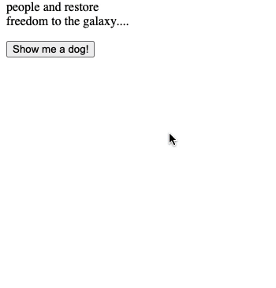
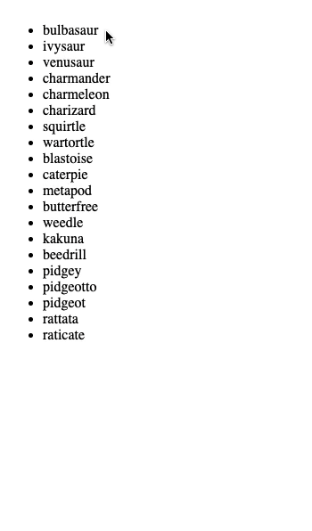

# Intro to Fetch Lab
 
 You will be creating a basic webpage that communicates with three APIs. You are responsible for creating the basic (but necessary) project files. For each of the features below, you must make `GET` requests using  [`fetch`](https://developer.mozilla.org/en-US/docs/Web/API/Fetch_API/Using_Fetch).
 
 ## Feature 1: Star Wars API.
 
Somewhere on your webpage, you should make a button with the words `Get Opening Crawl` and a `div` with an `id` of `star-wars`. When the user clicks on the button, it will add the opening crawl of one of the Star Wars movies to your `#star-wars` div. You will be using the [Star Wars API](https://swapi.dev/documentation). If the user clicks on the button again, since the opening crawl is already displayed, then nothing about your webapage should change (in order words, we should **not** see two opening crawls).

You can make a request to `GET https://swapi.dev/api/films/1/`.

## Feature 2: DOG CEO API

Somewhere on your webpage, you should make a button with the words `Show me a dog!` and a `div` with an `id` of `dog-picture`. When the user clicks on the button, it will display a picture of a random dog inside your `#dog-picture` div. The dog picture should be exactly `300px` wide. Use the [DOG CEO API](https://dog.ceo/dog-api/documentation/). Read through the documentation to figure out what URL you will need to make your request to. If the user clicks the button again, the dog picture should change to another random dog picture. 

## Feature 3: Gotta catch 'em all!

Somewhere on your webpage, you should make a button with the words `Gotta catch 'em all!` and a `ul` with an `id` of `pokemon-list`. When the user clicks on the button, it will display a list of pokemon from the [Pokemon API](https://pokeapi.co/docs/v2) and **the button dissapears**. The number of pokemon you display in your list is up to you. 

Then, if a user clicks on one of the pokemon names, it will make another request to the API to get information about that specific pokemon. This individual pokemon's data should completely replace the pokemon list on the webpage. You should include at least the information of `name`, `weight`, `height` and include a picture of the `front_sprite`. You should read the documentation to figure out what URLs to fetch to. 

## Bonus Feature 

After a user clicks an individual pokemon, their information replaces the pokemon list. Create a `Back to All Pokemon` button that allows the user to see the list of all pokemon again. If the user clicks on a different pokemon on the list, then the list will again be replaced with that individual pokemon's data.

